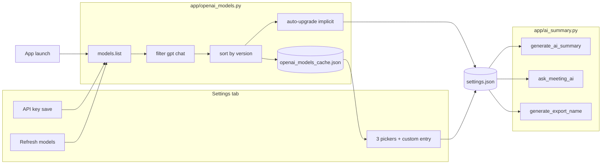

# feat: OpenAI model picker

**Created:** 2026-06-21  
**Origin:** Brainstorm dialogue (2026-06-21) — no requirements doc on disk yet; decisions captured below.  
**Depth:** Standard

---

## Summary

Add a Settings-section model picker so users can choose OpenAI chat models per AI feature (Summary, Ask AI, export naming). The app fetches `models.list` once per key-save / launch / manual refresh, caches results locally, shows a short recommended list plus custom model ID, and auto-upgrades implicit defaults when a newer GPT is detected — without touching transcription (Parakeet) models.

---

## Problem Frame

All three OpenAI call sites in `app/ai_summary.py` hardcode `gpt-5.2`. Users cannot switch models for cost, quality, or future deprecation resilience. OpenAI’s model catalog changes over time; a static hardcode requires app updates to stay current.

**Success means:** A user with a saved API key can see recommended models, pick (or type) a model per feature, and AI calls use that model. Existing users keep working on `gpt-5.2` until a refresh promotes a newer implicit default. Offline or failed refresh falls back to the last cache (or `gpt-5.2`). No new abstractions beyond one small module and existing settings/GUI patterns.

---

## Requirements

| ID | Requirement |
|---|---|
| R1 | Fetch chat-capable models from OpenAI via `client.models.list()` when an API key exists, on: key save, app launch (background), and manual **Refresh models**. |
| R2 | Cache the filtered model list on disk (app data dir); on fetch failure, use cache; if no cache, fall back to `gpt-5.2` only. |
| R3 | Show a short **recommended** list (~top 5 newest `gpt-*` chat models by version heuristic) plus **Custom model ID** per feature in Settings. |
| R4 | Persist per-feature model choice in `settings.json`: Summary, Ask AI, export naming — each independent. |
| R5 | Track per-feature **explicit choice**: when `false`, auto-upgrade to app recommended default on refresh; when `true`, never change that feature’s model on refresh. |
| R6 | Legacy / unset behavior: all three features default to `gpt-5.2`, all implicit (`explicit: false`) until the user changes a picker. |
| R7 | Wire `generate_ai_summary`, `ask_meeting_ai`, and `generate_export_name` to accept and use the resolved model ID from settings. |
| R8 | Pass `reasoning_effort="low"` only when the model likely supports it; retry without it on unsupported-parameter API errors. |
| R9 | UI: disable **Refresh models** while in flight; show subtle stale/failure hint when refresh fails but cache exists; pickers disabled until API key is saved. |
| R10 | Unit-test filter, sort, recommended extraction, auto-upgrade logic, and reasoning-effort gating — no GUI tests. |

---

## Key Technical Decisions

| ID | Decision | Rationale |
|---|---|---|
| KTD1 | **One module `app/openai_models.py`** for fetch, filter, sort, cache, recommended list, auto-upgrade, and reasoning gate | Keeps GUI thin; testable without Tk; avoids one-use abstractions spread across files. |
| KTD2 | **Cache file `openai_models_cache.json`** in app data (mirror `model_scan_cache.json`), not inside `settings.json` | Model list can be large; settings stay user prefs only; matches transcription cache pattern. |
| KTD3 | **Flat settings keys** — `openai_model_summary`, `openai_model_ask`, `openai_model_export`, plus `openai_model_*_explicit` booleans | Matches existing `settings.py` style; no nested schema migration. |
| KTD4 | **Recommended = top 5** of client-filtered `gpt-*` chat IDs sorted by parsed version (`gpt-5.5` > `gpt-5.2`), prefer non-dated aliases | Brainstorm heuristic; no server-side capability metadata available. |
| KTD5 | **App recommended default = #1** in that sorted list; auto-upgrade only features with `*_explicit: false` | Quality-first from brainstorm; explicit picks are sticky. |
| KTD6 | **Custom model ID** via dropdown option “Custom…” revealing a single `CTkEntry` per row (not a fourth global field) | Power users without showing full OpenAI catalog. |
| KTD7 | **`reasoning_effort` gated by prefix heuristic** (`gpt-5`, `o1`, `o3`, …); blacklist `-chat-latest`, `ft:`; retry once without param on `BadRequestError` | Today all calls use `reasoning_effort="low"`; custom IDs would break without this. |
| KTD8 | **Launch refresh in background thread** if key exists; do not block GUI; skip network if cache age &lt; 24h unless manual refresh | Brainstorm asked launch + cache; 24h TTL avoids hammering API. Key-save refresh always runs. |
| KTD9 | **No startup subprocess** for model fetch — lightweight GET in a daemon thread is enough (unlike HF scan) | Simpler than transcription’s subprocess; `models.list` is fast. |

**Simpler alternative considered:** One global model for all three features. Rejected — brainstorm chose per-feature pickers; cost/quality tuning differs by use case. Implementation stays minimal: shared cache and shared recommended list, three saved IDs.

---

## High-Level Technical Design

**Refresh sequence**

1. Read API key; if missing, return early (pickers show helper text).
2. If manual refresh OR cache missing OR cache older than 24h → `client.models.list()`.
3. Filter → sort → write cache atomically (write temp file, rename).
4. Compute new recommended default; for each feature with `*_explicit: false`, set model to recommended default; save settings.
5. Main thread updates dropdown values via `root.after(0, …)`.

---

## Scope Boundaries

### In scope

- Settings UI section under existing OpenAI API key block
- `app/openai_models.py`, `app/settings.py`, `app/ai_summary.py`, `app/gui.py`, `tests/test_openai_models.py`
- Brief README note that model choice is in Settings

### Deferred for later (brainstorm non-goals)

- Deprecation warnings or email-style alerts for retiring models
- Cost or token estimates per model
- Per-meeting or per-prompt model overrides
- Transcription model selection changes

### Deferred to follow-up work

- `auto_generate_export_name` setting (exists in defaults, not GUI) — when wired later, use `openai_model_export`
- Startup refresh when cache is fresh (&lt;24h) — optional optimization, not required for v1

### Outside this product’s identity

- Managing OpenAI billing, org projects, or fine-tune training

---

## Risks & Dependencies

| Risk | Mitigation |
|---|---|
| `models.list` heuristics include wrong IDs (audio-preview, etc.) | Conservative blacklist in filter; recommended list is `gpt-*` only |
| Auto-upgrade surprises users on cost | Only implicit defaults change; release note; user can pick any model to lock |
| Custom model rejects `reasoning_effort` | Retry without param (KTD7) |
| `save_settings` silent failure (existing pattern) | Accept for v1; show refresh errors in status label |
| OpenAI SDK unpinned (`openai>=1.0.0`) | Lazy import already used; no API shape change expected for `models.list` |

**Dependencies:** Existing `openai` package, saved API key, network for refresh.

---

## Implementation Units

### U1. OpenAI models module (core logic)

**Goal:** Testable fetch, filter, sort, cache, recommended list, auto-upgrade, and completion kwargs helper.

**Requirements:** R1, R2, R4, R5, R8

**Dependencies:** None

**Files:**
- Create `app/openai_models.py`
- Create `tests/test_openai_models.py`

**Approach:**
- Constants: `FALLBACK_MODEL = "gpt-5.2"`, `RECOMMENDED_COUNT = 5`, `CACHE_TTL_SEC = 86400`
- `get_cache_path()` → `%APPDATA%/Meetings/openai_models_cache.json` (same base as `api_key_storage`)
- `load_cache()` / `save_cache({fetched_at, model_ids})`
- `is_chat_model(id)` — prefix `gpt-`, exclude embedding/whisper/tts/dall-e/audio substrings
- `sort_gpt_models(ids)` — parse `gpt-X.Y` version float; prefer non-`YYYY-MM-DD` snapshot suffixes
- `recommended_models(ids, n=5)` — top n after sort
- `recommended_default(ids)` — first of recommended or `FALLBACK_MODEL`
- `fetch_models(api_key)` → `(model_ids, error)`; calls `OpenAI(api_key).models.list()`
- `refresh_models(api_key, *, force=False)` → load cache, fetch if needed, save, return `(model_ids, recommended, error, from_cache)`
- `apply_auto_upgrade(settings, recommended_default)` — mutates settings dict for non-explicit features; returns whether changed
- `supports_reasoning_effort(model_id)` — KTD7 heuristic
- `completion_kwargs(model, messages, **extra)` — adds `reasoning_effort` when supported; used by ai_summary
- `resolve_model(settings, feature)` — `feature` in `summary|ask|export`; returns model string with fallback

**Patterns to follow:** `app/transcription.py` cache path + atomic write; `app/ai_summary.py` lazy `openai` import

**Test scenarios:**
- Filter excludes `text-embedding-3-small`, `whisper-1`, `dall-e-3`
- Sort orders `gpt-5.5`, `gpt-5.2`, `gpt-4o` correctly
- `recommended_models` returns at most 5
- `apply_auto_upgrade` updates implicit features only
- `supports_reasoning_effort("gpt-5.2")` True; `("gpt-4o")` False; `("gpt-5-chat-latest")` False
- `refresh_models` with mocked fetch failure returns cached data when cache exists
- `refresh_models` with no cache returns fallback list containing `gpt-5.2`

**Verification:** `pytest tests/test_openai_models.py` passes; no GUI import in module.

---

### U2. Settings schema and defaults

**Goal:** Persist per-feature model IDs and explicit flags with safe defaults for upgrades.

**Requirements:** R4, R5, R6

**Dependencies:** U1 (`FALLBACK_MODEL`)

**Files:**
- Modify `app/settings.py`

**Approach:**
- Add to defaults dict in `load_settings()`:
  - `openai_model_summary`, `openai_model_ask`, `openai_model_export` → `FALLBACK_MODEL` (import constant or duplicate string once)
  - `openai_model_summary_explicit`, `openai_model_ask_explicit`, `openai_model_export_explicit` → `False`
- Merge from JSON if keys present; validate non-empty strings
- No migration script — missing keys get defaults (implicit `gpt-5.2`)

**Test scenarios:**
- `load_settings()` on empty/missing keys returns all six new fields with defaults
- Existing `settings.json` without new keys loads without error

**Verification:** Existing tests still pass; manual load of dev `settings.json` shows new keys after save.

---

### U3. Wire models into AI summary module

**Goal:** Replace hardcoded `gpt-5.2` with caller-supplied model; safe reasoning_effort handling.

**Requirements:** R7, R8

**Dependencies:** U1

**Files:**
- Modify `app/ai_summary.py`

**Approach:**
- Add optional `model=` param to all three public functions; default `FALLBACK_MODEL` for backward compatibility in direct calls/tests
- Extract small internal `_create_completion(client, model, messages)` that uses `completion_kwargs` from `openai_models`, catches `BadRequestError` (or message match for unsupported reasoning), retries once without `reasoning_effort`
- Do not change rate-limit behavior

**Test scenarios:**
- Mock client: completion called with expected `model`
- Mock client: when first call raises unsupported reasoning error, second call omits `reasoning_effort`

**Files (tests):**
- Extend `tests/test_openai_models.py` or add `tests/test_ai_summary_models.py` if cleaner — prefer keeping ai_summary tests minimal (mock OpenAI at boundary)

**Verification:** `pytest` passes; three call sites no longer contain literal `"gpt-5.2"` except as default constant reference.

---

### U4. Settings UI and refresh hooks

**Goal:** Expose three pickers, custom entry, refresh button, and hook key-save / launch refresh.

**Requirements:** R1, R3, R5, R9

**Dependencies:** U1, U2, U3

**Files:**
- Modify `app/gui.py`
- Modify `README.md` (one line under Settings)

**Approach:**
- Below API key row in Settings tab, add **AI models** subsection:
  - Label + `CTkOptionMenu` + optional `CTkEntry` (hidden until “Custom…”) for each: Summary, Ask AI, Export naming
  - **Refresh models** button + status label (“Last updated …”, “Couldn’t refresh — using cached list”, “Refreshing…”)
- Dropdown values = `recommended from cache` + current selection if not in list + `"Custom…"`
- On picker change (non-Custom): set model key + `*_explicit: True`; save settings
- On custom entry confirm (Return or focus-out): validate non-empty trimmed string; set explicit True
- `_save_openai_key`: after successful save, call `_refresh_openai_models(force=True)` in background thread
- On startup (after settings load, near update check): if key exists, `_refresh_openai_models(force=False)` in daemon thread
- `_refresh_openai_models`: disable refresh button; worker calls `refresh_models`; on success `apply_auto_upgrade` + `save_settings`; `root.after(0)` repopulate menus
- AI worker threads: read `resolve_model(app.settings, feature)` at call time and pass to ai_summary functions
- No API key: show subsection grayed/disabled with “Add an API key to load models”

**Patterns to follow:** `app/gui.py` update-check thread (~2215–2234); `CTkOptionMenu` like UI scale (~2136–2159)

**Test expectation:** none — GUI; covered by manual test plan below

**Verification:** Manual checklist (see Acceptance Examples)

---

### U5. Documentation touch-up

**Goal:** User-facing hint that model choice exists.

**Requirements:** (supporting R3)

**Dependencies:** U4

**Files:**
- Modify `README.md`

**Approach:** Under Settings bullet, add: optional model pickers for Summary, Ask AI, and export naming.

**Test expectation:** none — docs only

**Verification:** README renders correctly

---

## Acceptance Examples

| ID | When | Then |
|---|---|---|
| AE1 | User has no API key | Model pickers visible but disabled; AI actions still show existing “API key required” dialog |
| AE2 | User saves API key | Background refresh runs; pickers populate with recommended models |
| AE3 | User selects recommended model for Summary | `openai_model_summary_explicit` true; refresh does not change Summary model |
| AE4 | User never touches Ask AI picker; refresh finds `gpt-5.5` as new top | Ask AI model updates to `gpt-5.5`; Summary unchanged if explicit |
| AE5 | Offline launch with valid cache | Pickers use cache; subtle “Couldn’t refresh” if network fails |
| AE6 | User enters custom model `gpt-4o` | Summary uses `gpt-4o` without `reasoning_effort`; call succeeds |
| AE7 | Invalid custom model ID | Generate Summary shows OpenAI error in existing error dialog |

---

## Assumptions

- Brainstorm decisions from 2026-06-21 session apply: quality-first recommended list, per-feature pickers, auto-upgrade implicit defaults only, cache-on-failure, no deprecation UI in v1.
- `gpt-5.2` remains a valid fallback through implementation; if removed from API, custom entry still works.
- Users who want zero behavior change can select `gpt-5.2` explicitly once to lock all three features.

---

## Open Questions

None blocking — resolved in KTDs above.

---

## Sources & Research

- Repo: `app/ai_summary.py` (hardcoded model), `app/settings.py`, `app/api_key_storage.py`, `app/transcription.py` (`model_scan_cache.json` pattern), `app/gui.py` (Settings tab, background threads)
- OpenAI: [List models (Python SDK)](https://developers.openai.com/api/reference/python/resources/models/methods/list) — no server-side filter; four fields per model
- OpenAI: [Reasoning models](https://developers.openai.com/api/docs/guides/reasoning) — `reasoning_effort` not universal

---

## Manual Test Plan (post-implementation)

1. Fresh settings: verify three features use `gpt-5.2` on Generate Summary.
2. Save API key → pickers populate within a few seconds.
3. Pick cheaper/smaller model for Ask AI only → Ask AI uses it; Summary unchanged.
4. Refresh models → implicit features upgrade if top recommended changed (mock by editing cache in dev).
5. Airplane mode launch → cached list still shown; stale message visible.
6. Custom model entry → save and run Summary.
